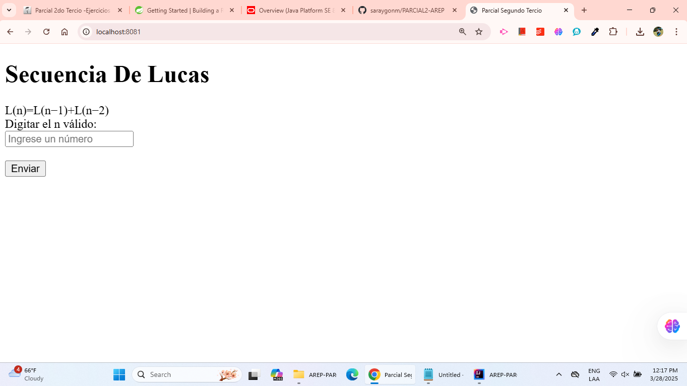

# SOLUCIÓN PARCIAL 2 AREP

---
## Autora
- Saray Alieth Mendivelso Gonzalez

----
## Descripción
En este proyecto se encuentra un prototipo de sistema de microservicios  el cual esta resolviendo
la secuencia de Lucas, la cual se calcula de la siguiente manera :

Para un n≥2: 

L(0)=2
L(1)=1
L(n)=L(n−1)+L(n−2)

**Encontraras  dos clases controller**

- LucasSeq (Logica de la secuencia de lucas)
- ProxyController (Componente encargado de recibir la peticion de un front de usuario y redirigirlas )
- SecuenciaLucas (Rama principal que contiene el main)

------

## Comenzando

Estas instrucciones te permitirán obtener una copia del proyecto en funcionamiento en tu máquina local para propósitos de desarrollo y pruebas.

### Prerequisitos

Antes de ejecutar el servidor es necesario contar con los siguientes programas instalados y funcionando:
- Java JDK 8 o superior
- Maven
- Git
- navegador web


---


### Instalación (Local)

1. Clone este repositorio localmente en un entorno o carpeta de trabajo.

```
$ git clone https://github.com/saraygonm/PARCIAL2-AREP.git```
```

2. **Entra en la carpeta del proyecto:**
   ```sh
   cd AREP- PARCIAL2
   ```

3. **Compila el proyecto con Maven:**
   ```sh
   mvn clean
   ```

4. restauracion del target.
   ```sh
   mvn springboot:run
   ```

- Anexo pruebas de que corre  usando los comandos anteriormente mencionados

<p align="center">

</p>

<p align="center">

</p>

5. **Accede a la aplicación en el navegador puerto 8081:**
```
http://localhost:8081/
```

<p align="center">

</p>

## Probando las funcionalidades

- n = 13
<p align="center">

</p>

- n=2
<p align="center">

</p>

- n=50
<p align="center">

</p>


---
## Despliegue en AWS

- Primero se deben crear las instancias una para el proxy y la otra para LucasSeq

<p align="center">

</p>

- se agrega la red TCP con puerto 8082 para proxy y 8081 para LucasSeq
<p align="center">

</p>

En este caso se muestra solo evidencia del proxy pero se hace lo  mismo para LucasSeq


## Evidencia de las dos instancias creadas 

<p align="center">

</p>